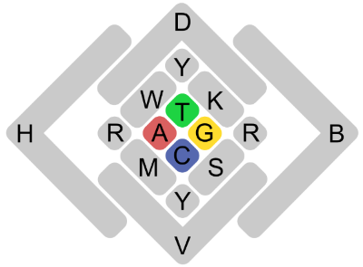
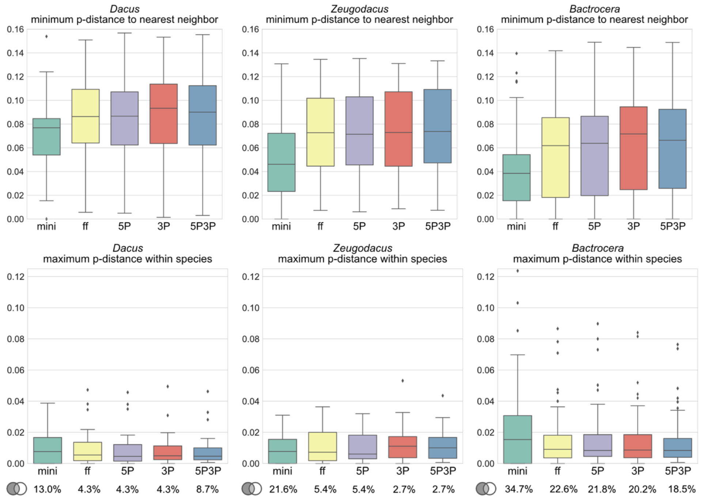

[](https://www.python.org/downloads/release/python-360/)
[](https://zenodo.org/badge/latestdoi/264048060)
(https://anaconda.org/cdoorenweerd/pycoistats/badges/installer/conda.svg)]

# PyCOIStats package
A collection of python modules to analyze haploid DNA sequence data (e.g., COI gene), filter non-distinct haplotypes, calculate pairwise distances, and plot graphs.


### How to cite

PyCOIStats vX (Doorenweerd et al. 2020)

Doorenweerd C, San Jose M, Leblanc L, Barr N, Geib S, Chung AYC, Dupuis J, Ekayanti A, Fiegalan ER, Hemachandra KS, Hossain MA, Huang C-L, Hsu Y-F, Morris KY, Mustapeng AM, Niogret J, Pham TH, Sirisena UGAI, Rubinoff D (2020) DNA barcodes and reliable molecular identifications in a diverse group of invasive pests: lessons from Bactrocera fruit flies on variation across the COI gene, introgression, and standardization. bioRxiv. https://doi.org/10.1101/2020.11.23.394510 

### Installation

The latest released version of PyCOIStats is available as an [Anaconda](https://anaconda.org/anaconda/repo) package in the channel `cdoorenweerd`. If you have Anaconda on your system, install pycoistats along with a new environment using `conda create -n pycoistatsenv -c cdoorenweerd pycoistats` to install all the dependencies and get the scripts as executables in the environment's /bin folder.

Alternatively, you can clone the github repo and use the scripts separately. For the list of module dependencies see the 'meta.yaml' file.


### Defining distinct haplotypes

A principle difference between PyCOIStats and most other software is in how it defines a distinct haplotype. For haploid sequence data, such as mitochondrial DNA, ambiguous bases should be interpreted as missing data. A distinct haplotype is therefore here defined as <mark>a confidently different sequence</mark>: [IUPAC](https://en.wikipedia.org/wiki/International_Union_of_Pure_and_Applied_Chemistry) ambiguity codes or missing data ("?") and gaps ("-") are ignored in comparisons. The full IUPAC alphabet includes 17 characters: A, C, T, G, N, ?, -, M, R, W, S, Y, K, V, H, D, B;



This definition implies that for example:

AACTGTCA and AACTNY-A

are considered non-distinct haplotypes (or you might say 'compatible').

This also affects pairwise distance estimates. Assume for example the following two sequences:

GCAAYTNN and GTAACTGC

Most other software counts 1 difference in 8 bases: 12.5% difference. PyCOIStats counts 1 difference in 5 bases (ignoring the ambiguities and not counting them towards compared strand length): 20.0% difference.


### Computational demand

Two scripts perform pairwise comparisons: the aln_hapcounter.py script compares sequences within species (less computationally intensive), and  aln_pdistancer.py compares sequences across the full alignment (more computationally intenstive). The pairwise comparisons will have exponential increases in computational time with more sequences. For a rough reference indication; running 8,000 sequences of 1493 base pairs took about 3 hours on a basic desktop machine. The scripts use basic python (specifically, the [itertools.combations](https://docs.python.org/3/library/itertools.html) function) which does not allow for use of multiple cores. The full dataset csv file created by aln_pdistancer is often too large to open with a spreadsheet editor (e.g., microsoft excel) but can be read directly by the Jupyter notebook to plot graphs (see examples).


### Alignment input format

Multisequence alignments are imported using the [biopython](https://biopython.org/) package, supporting commonly used formats such as FASTA, NEXUS and PHYLIP. For a full list of supported formats see the [biopython documentation](https://biopython.org/docs/dev/api/Bio.AlignIO.html).

The modules were created with haploid sequence data in mind but will run on any DNA sequence alignment. For diploid or polyploid sources however, ambiguity in the DNA character assignment can mean either uncertainty in the data or heterozygosity -- it often makes more sense to count such ambiguities as differences.

### Species name recognition

The scripts will use anything after a period "." in the sample identifier as the species name. Sample identifiers must be unique for each sequence. So for example this would work:

>'>LEASV1523-19.Caloptilia_betulicola
NACTCTTTATTTTATTTTTGGAATTTGAGCCGGTATATTAGGAACTTCTTTAAGAATATTAATTCGAGCAGAATTAGGTAATCCAGGATCTTTAATTGGGGATGATCAAATTTATAATACAATTGTTACAGCTCATGCTTTCATTATAATTTTCTTTATAGTTATACCTATTATAATTGGGGGATTTGGGAATTGATTAGTCCCATTGATATTAGGAGCACCTGATATAGCTTTCCC
>
>'>ABASV1522-19.Caloptilia_rufipennella
NACTCTTTATTTTATTTTTGGAATTTGATCCGGTATATTAGGAACTTCTTTAAGAATATTAATTCGAGCAGAGTTAGGTAATCCAGGATCTTTAATTGGTGATGATCAAATTTATAATACCATTGTTACAGCTCACGCTTTTATTATAATTTTTTTTATAGTTATACCTATTATAATTGGGGGATTTGGAAATTGATTAGTGCCATTAATATTAGGGGCACCTGATATAGCATTCCC
>
>'>LETRA472-19.Caloptilia_rufipennella
NACTCTCTACTTTATTTTCGGAATTTGATCTGGAATATTAGGAACATCTTTAAGTATATTAATTCGAGCTGAATTAGGTAATCCAGGATCTTTAATTGGGGATGATCAAATTTATAATACTATTGTTACAGCTCATGCTTTTATTATAATTTTTTTTATAGTTATACCTATTATAATTGGTGGATTTGGAAACTGATTAGTGCCATTAATATTAGGGGCTCCTGATATAGCTTTCCC


### Script functions

For each script, run `-h` for usage instructions.

- `aln_summary.py` outputs count and proportion of variable and parsimony informative sites to screen.

- `aln_renamer.py` changes sequence names in a fasta alignment based on a two column csv reference file with headers 'current_name' and 'new_name'. With the '-l' flag the script will simply generate a txt file with all current sequence names. This script is helpful to get the species naming convention right.

- `aln_filter.py` filters sequences to meet the minimum length requirement and removes non-distinct haplotypes, outputs a new fasta. Recommended to run before aln_pdistancer. Non-distinct haplotypes across different species raise a warning and are retained. Can also remove the third codon positions from an alignment with the flag -w.

- `aln_splitspecies.py` will generate a separate fasta for each species in a subfolder /species_fastas

- `aln_hapcounter.py` outputs a csv file with statistics per species:
    - Sequence count
    - Distinct haplotype count
    - Chao1 estimate of total haplotype diversity (uses [scikit-bio Chao1](http://scikit-bio.org/docs/0.5.6/generated/skbio.diversity.alpha.chao1.html?highlight=chao1))
    - Chao1 estimate 95% lower and upper confidence intervals

- `aln_pdistancer.py` calculates pairwise distance statistics and outputs two csv tables.
    The first table has statistics for the whole alignment (this file can get large):
    - intraspecific distances (all_intra)
    - interspecific distances (all_inter)
    - maximum intraspecific distances (Dmax)
    - minimum distances to the nearest neighbor (Dmin_NN)
    
    A second csv is produced with statistics per species:
    - Average intraspecific distance between sequences (avg_intra)
    - maximum intraspecific distance Dmax (intra_d_max)
    - number of intraspecific sequence comparisons (n_intra_comparisons)
    - average distance between sequences within species (avg_inter)
    - minimum distance to the nearest neighbor Dmin_NN (inter_Dmin_nn)
    - number of species compared to determine nearestneighbor (n_inter_comparisons)
    - sample name of the nearest neighbor (nearest_neighbor)

The Jupyter Notebook `graphs.ipynb` contains scripts to interactively generate ('barcode gap') violin plots from the csv output from ```pdistancer.py``` and output the graphs for publication.


### Example workflows


Example output, as [published](https://doi.org/https://doi.org/10.1101/2020.11.23.394510)


