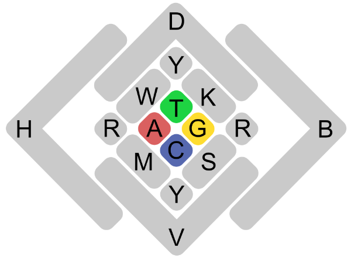
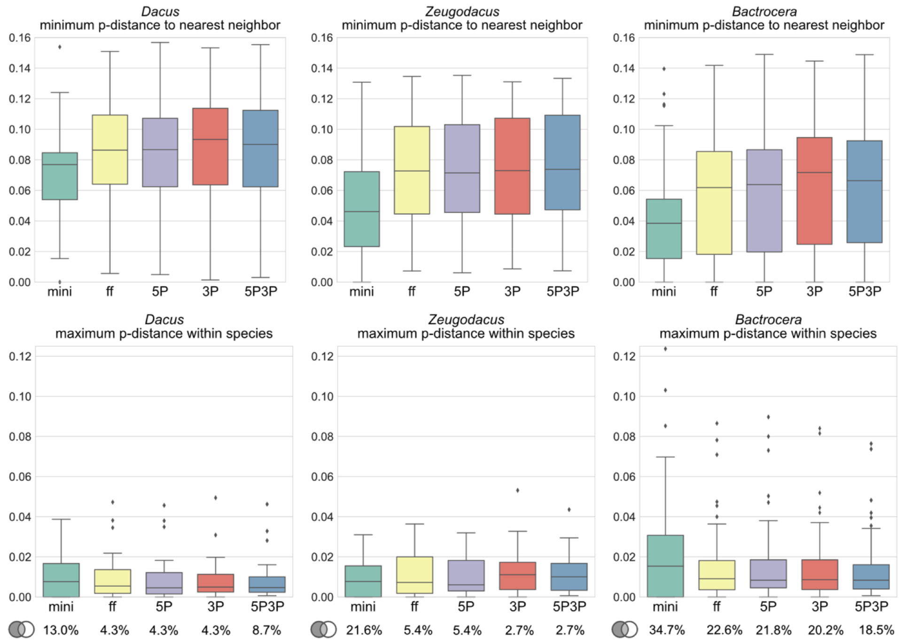

[](https://www.python.org/downloads/release/python-360/)
[](https://zenodo.org/badge/latestdoi/264048060)

# PyCOIStats package
A collection of python modules to analyze COI data, filter non-distinct haplotypes, calculate pairwise distances, and plot graphs.


### How to cite

PyCOIStats vX (Doorenweerd et al. 2020)

Doorenweerd C, San Jose M, Leblanc L, Barr N, Geib S, Chung AYC, Dupuis J, Ekayanti A, Fiegalan ER, Hemachandra KS, Hossain MA, Huang C-L, Hsu Y-F, Morris KY, Mustapeng AM, Niogret J, Pham TH, Sirisena UGAI, Rubinoff D (2020) DNA barcodes and reliable molecular identifications in a diverse group of invasive pests: lessons from Bactrocera fruit flies on variation across the COI gene, introgression, and standardization. bioRxiv. https://doi.org/10.1101/2020.11.23.394510 

### Dependencies

All dependencies are available through Anaconda (https://anaconda.org/anaconda/repo). It is recommended to create a new conda environment with the required packages:

e.g. using

```conda create -n pycoistats python=3.6 -c bioconda -c conda-forge pandas itertools biopython numpy argpase os matplotlib seaborn csvkit r-base```

For further instructions on how to use conda environments see the [conda documentation](https://docs.conda.io/projects/conda/en/latest/user-guide/tasks/manage-environments.html)


### Defining distinct haplotypes

A principle difference between PyCOIStats and most other software is in how it defines a distinct haplotype. A distinct haplotype is a confidently different sequence: IUPAC ambiguity codes or missing data ("?") and gaps ("-") are ignored in comparisons. The IUPAC alphabet includes: A, C, T, G, N, ?, -, M, R, W, S, Y, K, V, H, D, B.



For example:

AACTGTCA and AACTNY-A

are considered non-distinct haplotypes (or you might say 'compatible').

This also affects pairwise distance estimates. Assume for example the following two sequences:

GCAAYTNN and GTAACTGC

Most other software counts 1 difference in 8 bases: 12.5% difference. PyCOIStats counts 1 difference in 5 bases (ignoring the ambiguities and not counting them towards compared strand length): 20.0% difference.

Ideally, when COI data is of extremely high quality and all sequences are of equal length and have no ambiguous bases, this would not make a difference. However, practice is that missing or ambiguous data is common and should be interpreted correctly.


### Computational demand

The modules with pairwise comparisons will have exponential increases in computational time increases with more sequences. However, it should be able to handle 5,000 sequences [12.5 million pairwise comparisons] in a couple of hours on most desktop machines, for larger datasets a computing cluster is advisable. I have not tested the limits of dataset sizes that can be handled, but 10,000 sequences [50 million pairwise comparisons] is probably pushing it.


### Alignment input format

SEQUENCES MUST BE PROPERLY ALIGNED. Alignments are imported with the biopython package, covering commonly used formats such as FASTA, NEXUS or PHYLIP. For a full list of supported formats see https://biopython.org/docs/dev/api/Bio.AlignIO.html.

The modules were created with haploid sequence data in mind but will run on any DNA sequence alignment. For diploid or polyploid sources however, ambiguity codes can mean a) uncertainty in the data or b) different alleles -- it makes more sense to count such ambiguities as differences.

### Species name recognition

SAMPLE NAMING CONVENTION

The scripts will use anything after a period "." in the sample identifier as the species name. Sample identifiers must be unique for each sequence. So for example this would work:

>'>LEASV1523-19.Caloptilia_betulicola
NACTCTTTATTTTATTTTTGGAATTTGAGCCGGTATATTAGGAACTTCTTTAAGAATATTAATTCGAGCAGAATTAGGTAATCCAGGATCTTTAATTGGGGATGATCAAATTTATAATACAATTGTTACAGCTCATGCTTTCATTATAATTTTCTTTATAGTTATACCTATTATAATTGGGGGATTTGGGAATTGATTAGTCCCATTGATATTAGGAGCACCTGATATAGCTTTCCC
>
>'>ABASV1522-19.Caloptilia_rufipennella
NACTCTTTATTTTATTTTTGGAATTTGATCCGGTATATTAGGAACTTCTTTAAGAATATTAATTCGAGCAGAGTTAGGTAATCCAGGATCTTTAATTGGTGATGATCAAATTTATAATACCATTGTTACAGCTCACGCTTTTATTATAATTTTTTTTATAGTTATACCTATTATAATTGGGGGATTTGGAAATTGATTAGTGCCATTAATATTAGGGGCACCTGATATAGCATTCCC
>
>'>LETRA472-19.Caloptilia_rufipennella
NACTCTCTACTTTATTTTCGGAATTTGATCTGGAATATTAGGAACATCTTTAAGTATATTAATTCGAGCTGAATTAGGTAATCCAGGATCTTTAATTGGGGATGATCAAATTTATAATACTATTGTTACAGCTCATGCTTTTATTATAATTTTTTTTATAGTTATACCTATTATAATTGGTGGATTTGGAAACTGATTAGTGCCATTAATATTAGGGGCTCCTGATATAGCTTTCCC


### Script functions

For each script, run `python script.py -h` for usage instructions.

- `aln_summary.py` gives a simple count of the variable and parsimony informative sites.

- `aln_renamer.py` changes sequence names in a fasta alignment based on a two column csv file. With the '-l' flag the script will simply generate a txt file with all current sequence names. This script is helpful to get the species naming convention right.

- `hapcounter.py` counts the total number of sequences and distinct haplotypes per species and outputs to csv file.

- `3rdcodonremover.py` filters the third codon positions from an alignment.

- `q_filter.py` filters sequences to meet the minimum length requirement and be distinct haplotypes, and writes the result to a new fasta. Non-distinct haplotypes across different species raise a warning and are retained.

- `pdistancer.py` calculates all intraspecific distances (all_intra), all interspecific distances (all_inter), the maximum intraspecific distances (Dmax) and minimum distances to the nearest neighbor (Dmin_NN) and outputs to a csv. Per v1.2 and later, a second csv table is produced with statistics per species [intra_Dmax, n_intra comparisons, avg_inter distance, inter_Dmin_nn, n inter comparison, nearest neighbor].

- the Jupyter Notebook `graphs.ipynb` contains scripts to interactively generate ('barcode gap') violin plots from the csv output from ```pdistancer.py``` and output the graphs for publication.

- `makespeciesfastas.py` will generate a separate fasta for each species in the folder /species_fastas


### Example workflows


Example output, as published in https://doi.org/https://doi.org/10.1101/2020.11.23.394510


